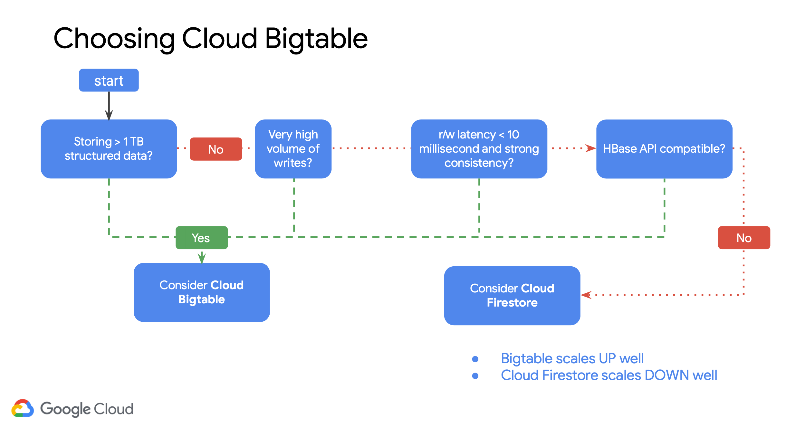

- [General](#general)
	- [Cheat Sheet](#cheat-sheet)
	- [Industries](#industries)
	- [Metadata](#metadata)
- [Cost Management](#cost-management)
	- [Quota types](#quota-types)
	- [Pricing innovations](#pricing-innovations)
	- [Billing export](#billing-export)
- [Trainings & Certifications](#trainings--certifications)
	- [Certification paths](#certification-paths)
	- [Platform](#platform)
- [Services](#services)
	- [Compute](#compute)
		- [Products](#products)
			- [Compute Engine](#compute-engine)
				- [Use when you need](#use-when-you-need)
				- [Typical use cases](#typical-use-cases)
			- [Kubernetes Engine](#kubernetes-engine)
				- [Use when you need](#use-when-you-need-1)
				- [Typical use cases](#typical-use-cases-1)
			- [App Engine](#app-engine)
				- [Use when you need](#use-when-you-need-2)
				- [Typical use cases](#typical-use-cases-2)
			- [Cloud Functions](#cloud-functions)
		- [Comparaison](#comparaison)
			- [More control](#more-control)
				- [Compute Engine](#compute-engine-1)
					- [Usage](#usage)
					- [Use this when you need](#use-this-when-you-need)
				- [Kubernetes Engine](#kubernetes-engine-1)
					- [Usage](#usage-1)
					- [Use this when you need](#use-this-when-you-need-1)
			- [Serverless](#serverless)
				- [Cloud Run](#cloud-run)
					- [Usage](#usage-2)
					- [Use this when you need](#use-this-when-you-need-2)
				- [App Engine](#app-engine-1)
					- [Usage](#usage-3)
					- [Use this when you need](#use-this-when-you-need-3)
				- [Cloud Functions](#cloud-functions-1)
					- [Usage](#usage-4)
					- [Use this when you need](#use-this-when-you-need-4)
		- [Decision tree for deployment options](#decision-tree-for-deployment-options)
	- [Storage](#storage)
		- [Storage and Database Decision Tree](#storage-and-database-decision-tree)
		- [Storage and database portfolio](#storage-and-database-portfolio)
		- [Products](#products-1)
			- [Relational](#relational)
				- [Cloud SQL](#cloud-sql)
					- [Good for](#good-for)
					- [Such as](#such-as)
				- [Cloud Spanner](#cloud-spanner)
					- [Good for](#good-for-1)
					- [Such as](#such-as-1)
				- [Relational DB Decision Tree](#relational-db-decision-tree)
			- [Non-Relational](#non-relational)
				- [Cloud Datastore](#cloud-datastore)
					- [Good for](#good-for-2)
					- [Such as](#such-as-2)
				- [Cloud Bigtable](#cloud-bigtable)
					- [Good for](#good-for-3)
					- [Such as](#such-as-3)
				- [Firestore](#firestore)
				- [Non-Relational DB Decision Tree](#non-relational-db-decision-tree)
			- [Object](#object)
				- [Cloud Storage](#cloud-storage)
					- [Good for](#good-for-4)
					- [Such as](#such-as-4)
	- [Big Data](#big-data)
		- [Products](#products-2)
			- [Warehouse](#warehouse)
				- [BigQuery](#bigquery)
					- [Good for](#good-for-5)
					- [Such as](#such-as-5)
			- [Pub/Sub](#pubsub)
			- [Dataflow](#dataflow)
			- [Dataproc](#dataproc)
			- [Datalab](#datalab)
	- [Machine Learning](#machine-learning)
		- [Products](#products-3)
- [Security & Data Privacy](#security--data-privacy)
	- [Penetration testings](#penetration-testings)
	- [Privacy](#privacy)
		- [Google Privacy Commitments](#google-privacy-commitments)
		- [Types of data](#types-of-data)
			- [Customer data](#customer-data)
			- [Service data](#service-data)
				- [Definition](#definition)
				- [Content](#content)
				- [Google Cloud Privacy Notice](#google-cloud-privacy-notice)
		- [Technical Controls for data privacy](#technical-controls-for-data-privacy)
			- [Access transparency and control](#access-transparency-and-control)
				- [Access Transparency (introduced in 2018)](#access-transparency-introduced-in-2018)
					- [Documentations](#documentations)
					- [Requirements](#requirements)
					- [Pricing](#pricing)
				- [Access Approval](#access-approval)
			- [Encryption at Google](#encryption-at-google)
			- [Encryption keys](#encryption-keys)
				- [Options](#options)
				- [Documentations](#documentations-1)
	- [Government requests](#government-requests)
- [Google Cloud Regions](#google-cloud-regions)
	- [Network](#network)
	- [Regions](#regions)
	- [Services in Europe](#services-in-europe)
- [Google Cloud Shell](#google-cloud-shell)
- [Command lines](#command-lines)
	- [gcloud](#gcloud)
- [Projects](#projects)
	- [Project ID](#project-id)
	- [Project name](#project-name)
	- [Project number](#project-number)
- [Comparaison with other cloud provider](#comparaison-with-other-cloud-provider)
	- [Azure](#azure)
	- [AWS](#aws)
- [Resource Management](#resource-management)
	- [Labels](#labels)
		- [Common examples](#common-examples)
			- [Team or cost center labels](#team-or-cost-center-labels)
			- [Component labels](#component-labels)
			- [Environment or stage labels](#environment-or-stage-labels)
			- [State labels](#state-labels)
- [Data Analytics](#data-analytics)
	- [Pipeline](#pipeline)
- [Buildpacks](#buildpacks)
	- [Description](#description)
	- [Advantages](#advantages)

# General

## Cheat Sheet

- [The Google Cloud Developer's Cheat Sheet](https://github.com/gregsramblings/google-cloud-4-words?utm_source=facebook&utm_medium=unpaidsocial&utm_campaign=googlecloud-other-notrelevant&utm_content=tipseducationdemos&linkId=74482141)
- [gcloud Cheat Sheet](https://cloud.google.com/sdk/docs/cheatsheet)

## Industries

- Retail
- Healthcare
- Financial Services
- Media & Entertainment
- Industrial & Manufacturing
- Public sector

## Metadata

- When you query for metadata, you must provide the flavor header:
  
  `Metadata-Flavor: Google`
  
  Examples
  
  ```bash
  curl "http://metadata.google.internal/computeMetadata/v1/instance/disks/" \
  -H "Metadata-Flavor: Google"
  ```

# Cost Management

## Quota types

- Allocation
- Rate

## Pricing innovations

- Sustained Use Discount
  - Up to 30% discount
- Preemptible VM instances
- Per-second billing
- Coldline
- Custom machine types
  - Save up to 48% compared to fixed machine types from other clouds
- Committed Use Discounts (CUD)
  - Up to 57% discount
  - No up-front fee
  - No instance-type lock-in

## Billing export

- BigQuery export
- File export

# [Trainings & Certifications](https://cloud.google.com/certification#certification_paths)

## Certification paths

- Associate
  - [Cloud Engineer](https://cloud.google.com/certification/cloud-engineer)
- Professional
  - [Cloud Architect](https://cloud.google.com/certification/cloud-architect)
    - Trainings
      - [Coursera](https://www.coursera.org/professional-certificates/gcp-cloud-architect)
  - [Cloud Developer](https://cloud.google.com/certification/cloud-developer)
  - [Data Engineer](https://cloud.google.com/certification/data-engineer)
  - [Cloud DevOps Engineer](https://cloud.google.com/certification/cloud-devops-engineer)
  - [Cloud Security Engineer](https://cloud.google.com/certification/cloud-security-engineer)
  - [Cloud Network Engineer](https://cloud.google.com/certification/cloud-network-engineer)
  - [Machine Learning Engineer](https://cloud.google.com/certification/machine-learning-engineer)
  - [Collaboration Engineer](https://cloud.google.com/certification/collaboration-engineer)
- User certification
  - [G-Suite](https://cloud.google.com/certification/gsuite)

## Platform

- Coursera

# Services

## Compute

### Products

#### Compute Engine

##### Use when you need

- Complete control
- Ability to make OS-level changes
- Ability to move to the cloud without rewriting your code
- To use custom VM images

##### Typical use cases

- Any workload requiring a specific OS or configuration
- On-premises software that you want to run in the cloud

#### Kubernetes Engine

##### Use when you need

- No dependencies on a spcecific OS
- Increased velocity and operability
- To manage containers in production

##### Typical use cases

- Containerized workloads
- Cloud-native distributed systems

#### App Engine

##### Use when you need

- To just focus on writing code
- Developer velocity
- To minimize operational overhead

##### Typical use cases

- Websites
- Apps (of course!)
- Gaming backends
- IoT applications

#### Cloud Functions

### Comparaison

#### More control

##### Compute Engine

###### Usage

- Existing systems / Virtual machines

###### Use this when you need

- Specific kernel & OS
- Windows licensing requirements
- Migrating existing systems
- Network protocols beyond HTTP(s)

##### Kubernetes Engine

###### Usage

- Containerized applications

###### Use this when you need

- Hybrid & multi-cloud deployments
- Strong CI/CD pipelines
- GPUs
- TPUs
- Specific OS
- Network protocols beyond HTTP(s)

#### Serverless

##### Cloud Run

###### Usage

- Events/Web + Containers

###### Use this when you need

- Stateless service
- HTTP requests
- Specific runtime
- Scale to high and low traffic

##### App Engine

###### Usage

- Web applications Hosting + Code

###### Use this when you need

- Host & run stateful app or stateless service
- HTTP requests
- URL routing
- Code sharing
- Traffic splitting
- Scale to high & low traffic

##### Cloud Functions

###### Usage

- Event driven

###### Use this when you need

- Events
- Function definitions
- HTTP requests
- Triggered from Pub/Sub and/or Cloud Storage
- Quick data transformations (ETL)
- Request an APIs

### Decision tree for deployment options


## Storage

### Storage and Database Decision Tree


### Storage and database portfolio


### Products

#### Relational

##### Cloud SQL

###### Good for

- web frameworks

###### Such as

- CMS
- eCommerce

##### Cloud Spanner

###### Good for

- RDBMS+scale
- HA
- HTAP

###### Such as

- User metadata
- Ad/Fin/MarTech

##### Relational DB Decision Tree


#### Non-Relational

##### Cloud Datastore

###### Good for

- Hierarchical
- Mobile
- Web

###### Such as

- User profiles
- Game state

##### Cloud Bigtable

###### Good for

- Heavy read + write
- Events

###### Such as

- AdTech
- Financial
- IoT

##### Firestore


##### Non-Relational DB Decision Tree




#### Object

##### Cloud Storage

###### Good for

- Binary or object data

###### Such as

- Images
- Media serving
- Backups

## Big Data

### Products

#### Warehouse

##### BigQuery

###### Good for

- Enterprise data warehouse

###### Such as

- Analytics
- Dashboards

#### Pub/Sub

#### Dataflow

#### Dataproc

#### Datalab

## Machine Learning

### Products

- Natural Language API
- Vision API
- Machine Learning
- Speech API
- Translate API

# Security & Data Privacy

## Penetration testings

- GCP does not require notification to perform penetrtion testing

## Privacy

### [Google Privacy Commitments](https://cloud.google.com/security/privacy)

- You control your data
  - Your data is processed according to your instructions
  - You can access it or take it out at any time
  - You are notified if a breach is detected that compromises your data
  - You have access controls to safeguard who has access to the data within and outside your organization
  - You have access to audit reports that keep track of all changes made and who touched what in your projects
  - You have access transparency logs expand visibility and control over your cloud provider with near real-time logs and approval controls

- We never use your data for ads targeting
  - Google Cloud does not sell customer data to third parties. Nor is it used in advertising

- We are transparent about data collection and use
- We never sell customer data or service data
- Security and privacy are primary design criteria for all our products
  - Data encrypted in transit and at rest
    - Your data is encrypted in transit and at rest at all times automatically. You do not have to ask or enable it, this happens by default
      - Additional enforcement
        - Customer Managed Encryption Keys (CMEK)
        - Customer Supplied Encryption Keys (CSEK)
    - [Encryption at rest in Google Cloud](https://cloud.google.com/security/encryption-at-rest/default-encryption)
		- [How does it work ?](https://youtu.be/Svz2KHE1mdM)

### Types of data

#### Customer data

- [GCP Terms of Service](https://cloud.google.com/terms)

#### Service data

##### Definition

- Service Data is the personal information Google collects or generates during the provision and administration of the Cloud Services, excluding any Customer Data and Partner Data

##### Content

- Cloud payments and transactions
- Cloud settings and configuration
- Technical and operational details of your usage of Cloud Services
- Your direct communications

##### [Google Cloud Privacy Notice](https://cloud.google.com/terms/cloud-privacy-notice)

### Technical Controls for data privacy

#### Access transparency and control

##### [Access Transparency (introduced in 2018)](https://cloud.google.com/blog/products/gcp/building-trust-through-access-transparency)

###### Documentations

- [Google Cloud Platform](https://cloud.google.com/logging/docs/audit/access-transparency-overview)
  - [Google services with Access Transparency logs](https://cloud.google.com/logging/docs/audit/access-transparency-services)
- [G Suite](https://support.google.com/a/answer/9230474?hl=en&ref_topic=9230579)

###### Requirements

- Organization
- Customer support level
  - Premium
  - Enterprise
  - Platinum
  - Gold

###### Pricing

- Non-chargeable

##### [Access Approval](https://cloud.google.com/access-transparency)

- [Documentation](https://cloud.google.com/access-transparency)

#### Encryption at Google

- [Encryption at rest](https://cloud.google.com/security/encryption-at-rest/default-encryption/)
- [Encryption in transit](https://cloud.google.com/security/encryption-at-rest/default-encryption/)

#### Encryption keys

##### Options

- [Google-managed encryption keys](https://cloud.google.com/storage/docs/encryption/default-keys)
  - Internal Key Management Service (KMS)
    - Keys managed by Google
  - Cloud Key Management Service (Cloud KMS)
    - Keys managed by Google

- [Customer-managed encryption keys (CMEK)](https://cloud.google.com/storage/docs/encryption/customer-managed-keys)
- [Customer-supplied encryption keys (CSEK)](https://cloud.google.com/security/encryption-at-rest/customer-supplied-encryption-keys/)

##### Documentations

- [Cloud Key Management Service deep dive](https://cloud.google.com/security/key-management-deep-dive)

## Government requests

- [Governmant Access Whitepaper](https://services.google.com/fh/files/blogs/government_access_technical_whitepaper.pdf)
- There are explicit rules to guard against insider access to your data and no “backdoor” to Google
  - Invalid government requests are rejected
  - [Transparency report is published for those requests](https://transparencyreport.google.com/?utm_medium=et&utm_source=google.com%2Fcloud&utm_campaign=privacy&utm_content=privacy_commitments_to_data)

# Google Cloud Regions

## [Network](https://cloud.google.com/about/locations#network)

## [Regions](https://cloud.google.com/about/locations#regions)

## [Services in Europe](https://cloud.google.com/about/locations#europe)

# Google Cloud Shell

- It offers a persistent 5GB home directory

# Command lines

## gcloud

- [Documentation](https://cloud.google.com/sdk/gcloud/)

# Projects

## Project ID

- Globally unique
  - Chosen by you
    - Immutable

## Project name

- Need not be unique
  - Chosen by you
    - Mutable

## Project number

- Globally unique
  - Assigned by GCP
    - Immutable

# Comparaison with other cloud provider

## [Azure](https://cloud.google.com/docs/compare/azure)

- [Compute](https://cloud.google.com/docs/compare/azure/compute)
- Terminologies

	| Azure | GCP |
	|---|---|
	| Resources | Resources |
	| Resource Groups | Projects |
	| Subscriptions | Folders |
	| Management Groups | Google Cloud Organizations |

## [AWS](https://cloud.google.com/docs/compare/aws)

# Resource Management

- Why use project quotas ?
  - Prevent runaway consumption in case of an error or malicious attack
  - Prevent billing spikes or surprises
  - Forces sizing consideration and periodic review

## Labels

- Up to 64 labels per resource
- Tags != Labels
  - Tags are applied to instances only
  - Tags are mainly used for networking (applying firewall rules)

- Why are labels useful ?
  - Resource Management
    - Quickly find resources associated with specific workloads, environments, ownership groups or other important infromation
    - Critical to assigning organizational roles and access permissions for resource management

  - Automation
    - Allows you to take advantage of automation
      - resource creation
      - operational monitoring
      - creation of DevOps processes

  - Accounting
    - Making business groups aware of cloud resource consumption
      - chargeback
      - showback

### Common examples

#### Team or cost center labels

- team:research
- team:analytics
- costcenter:finance
- costcenter:marketing

#### Component labels

- component:redis
- component:frontend
- component:ingest
- component:dashboard

#### Environment or stage labels

- environment:production
- environment:test

#### State labels

- state:active
- state:readytodelete
- state:archive

# Data Analytics

## Pipeline


# Buildpacks

## Description

- Creates containers (OCI compliant) without a dockerfile

## Advantages

- Security audited
- Build your code the Google Way
- Container novices can deploy to container platforms
- Quick & Easy Builds
- Migrating from App Engine or Cloud Functions
- Integrated with Google Cloud products